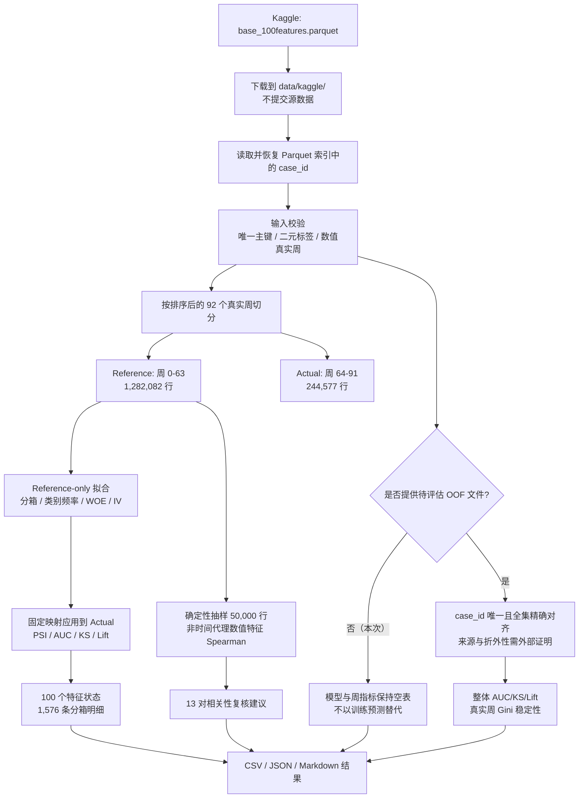

# Home Credit Risk Diagnostics V3 中文结果报告

## 1. 执行摘要

本次交付在**不改写两份原始竞赛 Notebook、不重训 LightGBM/CatBoost**的前提下，为一个真实的 Home Credit 客户级中间特征表增加了独立、可复现的 Diagnostics V3 诊断层。输入来自 Kaggle 数据集 [`diarray/deep-feature-synthesis-home-credit-stability`](https://www.kaggle.com/datasets/diarray/deep-feature-synthesis-home-credit-stability) 的 `base_100features.parquet`，实际检查了 1,526,659 个唯一客户、47,994 个正例、92 个真实周和 100 个特征。

诊断严格按真实周前后切分：周 0–63 为 Reference，周 64–91 为 Actual。所有分箱、类别频率、WOE 和 IV 只在 Reference 拟合，再原样应用到 Actual 计算 PSI、单变量 AUC、KS、Lift@10% 和 Lift@20%。结果生成 1,576 条分箱明细、13 对高相关特征建议，并把 100 个特征归入 2 个常量复核、26 个高漂移复核、67 个保留候选和 5 个时间代理复核。

最重要的结论不是“找到一个可以直接上线的最强特征”，而是：Actual 单变量 AUC 最高的三个特征同时具有明显高 PSI。它们有区分力，但稳定性不足，必须继续做定义、数据链路、客群与分箱级归因。**高 PSI 特征既不能因为 AUC 高就直接上线，也不能因为漂移高就直接删除。**本次输出是筛查和复核清单，不是生产准入或删除决策。

原仓库没有保存可证明来源的全量 OOF 预测，因此本次没有用训练集预测冒充 OOF，也没有填造模型 AUC 或周稳定性指标；`model_diagnostics.csv` 和 `weekly_model_metrics.csv` 按设计保持空表。程序能够检查预测文件的主键、覆盖和缺失结构，但不能仅凭分数证明它确实来自折外模型；本次的安全边界来自没有提供任何无法核验来源的预测。

## 2. 目标与范围

本次目标是回答三个实际问题：

1. 现有客户级特征在较早时间窗与较晚时间窗之间是否发生分布变化；
2. 单个特征在未参与分箱拟合的后段周上还有多少排序能力；
3. 哪些特征需要优先进入常量、稀疏、时间代理、高漂移或相关性复核。

纳入范围：

- 真实 Kaggle 中间特征表的加载、字段标准化和输入校验；
- 基于有序真实周的 Reference/Actual 切分；
- Reference-only 分箱、WOE、IV，以及 Actual PSI/AUC/KS/Lift；
- 缺失、稀有类别和 Actual 新类别的显式分桶；
- 确定性抽样的 Spearman 高相关复核建议；
- 可选预测文件的主键/覆盖结构检查，以及整体指标和 Home Credit 周 Gini 稳定性计算；预测来源与折外性仍需外部证据；
- AMEX 中可迁移聚合模式的安全实现。

不在范围：

- 从 Home Credit 原始多表重新构建 472 列或其他完整训练矩阵；
- 修订或重新执行原始 Notebook；
- 重新训练 CatBoost、LightGBM、Transformer 或任何组合模型；
- 生成竞赛提交文件，或把单变量结果解释成完整模型结果；
- 根据 PSI 或相关性结果自动删除、自动上线特征。

## 3. 真实数据来源与不可分发边界

| 项目 | 本次实际使用 |
|---|---|
| Kaggle 数据集 | `diarray/deep-feature-synthesis-home-credit-stability` |
| 文件 | `base_100features.parquet` |
| 数据形态 | 已处理的客户级中间特征表 |
| 存储字段 | 103 个，包括 `case_id`、`target`、周字段等元数据 |
| 诊断特征 | 100 个 |
| 本地数据目录 | `data/kaggle/`，已在 `.gitignore` 排除 |
| 仓库是否分发 Parquet/ZIP | 否 |

数据集上传页标注的 MIT 标签不能替代底层 [Home Credit 竞赛规则](https://www.kaggle.com/competitions/home-credit-credit-risk-model-stability/rules)。代码许可与数据使用权是两个边界：本仓库只提交代码和轻量诊断结果，不提交下载到本地的 Parquet 或 Kaggle ZIP。使用者需要自行确认其 Kaggle 账户权限与数据用途合规性。

本次下载时没有要求人工登录；若 Kaggle 后续改变访问策略，应在 Kaggle 官方界面完成登录或配置官方 API 凭证，不应把凭证提交到仓库。整个流程没有增加额外 SHA256 清单或重型校验环节，数据校验集中在业务主键、字段、标签与时间范围。

需要特别注意：这是一张已经过 DFS/筛选处理的中间表。100 个被诊断特征在本文件中观察到的 Reference/Actual 缺失率均为 0，这只说明当前中间表的编码或预处理结果，**不能推导原始业务表没有缺失，也不能替代上游缺失值监控**。

## 4. 原始 Notebook 审查与保留策略

本次遵循“重构前先过原代码、细节补丁要保留”的原则。采取的是**旁路新增诊断包**，而不是重写 Notebook；分支相对原始 `main` 的差异不包含两份 `.ipynb`，因此其原始内容保持不变。

### 4.1 `do-it-again (1).ipynb`

原 Notebook 从竞赛多张 Parquet 表出发，用 Polars 聚合和拼接训练/测试特征，再训练 CatBoost 与 LightGBM。审查时保留并记录了下列有价值的细节边界：

- `vertical_relaxed` 拼接用于兼容分片间可放宽的 schema；
- 按字段后缀做类型转换，并在大表处理中继续使用降精度、垃圾回收等内存控制；
- 对 `riskassesment_302T` 做字段存在和全空类型保护；
- 特征筛选以训练集为基准，测试集随后按训练列名和顺序精确对齐；
- CatBoost 前的字符串表示与 LightGBM 前的 category 表示分开处理；
- `case_id` 与 `week_num` 不作为最终模型特征，交叉验证按 `week_num` 分组；
- `StratifiedGroupKFold` 的按周分组意图和 `VotingModel` 的概率平均逻辑继续作为历史模型语义；
- 原有 dry-run、内存释放和结果保存意图没有在本次诊断层中被悄悄改变。

同时识别到一些不能在本次结果中掩盖的问题：原代码没有保存可完整对齐的 OOF；`train_final.parquet` 写出被注释；`riskassesment_302T` 的 `drop` 没有接回 DataFrame；部分已定义聚合没有进入最终表达式；CatBoost 固定 GPU；部分 LightGBM 正则参数名存在兼容风险；全局屏蔽 warning 会降低排错可见性。本次没有重写这些历史代码，也没有把其历史 CV 输出当成本次模型结果。

### 4.2 `notebookd5e70ab4ab.ipynb`

第二份 Notebook 依赖私有 Kaggle 中间数据集 `home-credit-big-data` 下的 `df_train_output.parquet`、`df_test_output.parquet` 和 `cat_cols_output.parquet`。历史输出显示训练矩阵为 1,526,659 × 472、测试矩阵为 10 × 471、类别列为 72 个，但该中间数据并不是第一份 Notebook 当前可直接产出的受控交付物。

审查确认它包含类别列列表兼容、`y`/`weeks` 复制、按周分组 CV、固定随机种子、单周双类别检查和模型保存意图；这些都被视为应保留的安全边界。另一方面，它曾把 `week_num` 重新放回特征、Optuna 使用单折进行选择、稳定性横轴未使用真实周值，且历史执行停在 LightGBM 错误。Diagnostics V3 因此独立实现真实周排序和 OOF 精确对齐，不继承这些有泄漏或失真的做法。

## 5. 端到端流程



## 6. 逐步执行过程

### 6.1 下载真实 Kaggle 中间数据

只下载目标文件，不拉取整个数据集，也不把源数据加入 Git：

以下命令依赖外部 Kaggle CLI；它不在本项目的依赖清单中。可先执行
`python -m pip install kaggle`，并按 Kaggle 当时的访问要求完成登录或规则接受。

```bash
kaggle datasets download \
  -d diarray/deep-feature-synthesis-home-credit-stability \
  -f base_100features.parquet \
  -p data/kaggle \
  --unzip
```

### 6.2 加载、标准化与验证

读取 Parquet 后，加载器处理了一个真实兼容点：`case_id` 在 Pandas/Parquet 元数据中可能恢复成索引，因此先将命名索引还原为列；`WEEK_NUM` 则以大小写不敏感方式解析成配置字段 `week_num`。

输入守门检查包括：

- `case_id` 非空且唯一；
- `target` 只能是 0/1，且全量存在；
- 周字段可以转成数值，且不存在缺失；
- 排除 `case_id`、`target`、`week_num` 后确有可诊断特征；
- 不把元数据列误传入特征列表。

### 6.3 按真实周切分

默认 `reference_fraction=0.70`。程序先提取、排序 92 个真实周值，再按周数而不是按行号切分：前 64 周进入 Reference，后 28 周进入 Actual。这样可避免随机切分把未来分布混入分箱拟合。

### 6.4 只在 Reference 拟合

每个数值特征最多拟合 10 个 Reference 分位数区间；重复分位点会自动合并。类别特征按 Reference 频次排序，最多保留 100 个类别。缺失、长尾其他类别和 Actual 新类别分别进入 `__MISSING__`、`__OTHER__`、`__UNSEEN__`，不会被静默混成同一类。

随后只用 Reference 标签计算 WOE 与 IV，并以 0.5 平滑防止零好样本或零坏样本导致无穷值。Actual 标签在这一阶段完全不参与边界、类别名单或 WOE 拟合。

### 6.5 在 Actual 做后段诊断

Reference 的固定分箱原样应用于 Actual：

- PSI 检查分布漂移；默认 `PSI >= 0.25` 触发高漂移标记；
- Reference WOE 映射作为单变量风险分数，计算 Actual AUC、KS、Lift@10% 和 Lift@20%；
- Lift 对相同分数采用 tie-aware 分配，避免依赖任意行顺序；
- Reference 缺失率 95%–99.5% 为稀疏挽救候选，达到 99.5% 为极端稀疏复核；
- 常量、极端稀疏、稀疏候选、时间代理、高漂移、保留候选按优先级形成互斥主状态。

### 6.6 相关性复核

相关性只看 Reference、只看数值特征，并排除时间代理。固定随机种子 42，从 Reference 确定性抽样最多 50,000 行，计算 Spearman 相关系数；绝对值达到 0.90 才进入输出。

系统按更高 IV、再按更低 PSI/缺失率给出 `recommend_keep` 与 `recommend_review`，但理由字段明确要求结合业务含义确认。相关输出是人工复核排序，绝不是自动删列指令。

### 6.7 OOF 结构检查与周稳定性

若提供 OOF，程序要求：

- OOF `case_id` 非空且唯一；
- 与训练集 `case_id` 集合精确一致，既不能缺也不能多；
- 显式指定的分数列必须存在且无缺失；未指定时只自动选择数值列；
- 合并后继续保持原训练行数。

这些检查只能确认文件结构与主键覆盖，不能从分数值反推模型训练过程，也不能证明预测确实是折外结果。预测提供方仍须保存折分配、训练清单和生成过程等外部证据。通过上述结构检查后，程序才会计算整体 AUC/KS/Lift，以及按排序真实周计算 Gini。周稳定性公式为：

```text
mean(weekly_gini) + 88 × min(0, gini_slope) - 0.5 × std(gini_residual)
```

本次原仓库没有可核验来源的 OOF，因此走“无输入、跳过”分支。安全性来自没有把训练集预测或来源不明分数填进报表，而不是程序自动识别出了预测的训练来源。

### 6.8 AMEX 借鉴与改造

实现交叉参考了 AMEX Kaggle 的
[`Amex Agg Data How It Created`](https://www.kaggle.com/code/huseyincot/amex-agg-data-how-it-created)
和 [`Lag Features Are All You Need`](https://www.kaggle.com/code/thedevastator/lag-features-are-all-you-need)，
主要迁移两类通用模式：

- 数值历史的 count/mean/std/min/max/sum/nunique；
- 类别历史的 count/nunique/mode，以及客户时间序列的 first/last/差值。

迁移时增加了关键约束：first、last、last-minus-first、last-minus-mean 只有在显式提供时间列后才生成；若同一客户同一时间有多行，必须再提供能唯一排序的 tie-breaker。Parquet 当前行顺序永远不被当成时间顺序。

没有迁移 AMEX 竞赛指标，也没有采用 Transformer 序列模型。Home Credit 保留真实周 Gini 稳定性；异构历史表也不能被未经验证地当成一个同质序列。

## 7. 完整关键结果

### 7.1 数据与时间切分

| 期间 | 周范围 | 周数 | 行数 | 正例数 | 坏率 |
|---|---:|---:|---:|---:|---:|
| 全量 | 0–91 | 92 | 1,526,659 | 47,994 | 3.1437% |
| Reference | 0–63 | 64 | 1,282,082 | 42,524 | 3.3168% |
| Actual | 64–91 | 28 | 244,577 | 5,470 | 2.2365% |

Reference 与 Actual 行数、周数、正例数均可回加到全量。Actual 坏率较 Reference 下降约 1.0803 个百分点（相对约 32.6%），说明后段时间窗的标签基准率本身已经变化；因此只看随机 CV 或单一整体 AUC 会遗漏时间迁移风险。

### 7.2 特征状态

| 互斥主状态 | 数量 | 含义 |
|---|---:|---|
| `CONSTANT_REVIEW` | 2 | Reference 非缺失唯一值不超过 1，需要查字段生成和后段新值 |
| `HIGH_DRIFT_REVIEW` | 26 | 主状态命中 PSI 阈值，需要漂移归因 |
| `KEEP_CANDIDATE` | 67 | 未命中前置复核条件，仍需模型与业务验证 |
| `TIME_PROXY_REVIEW` | 5 | 日期/月/季节等代理，避免直接承载风险判断 |
| 合计 | 100 | 与诊断特征总数一致 |

由于主状态有优先级，底层 `high_drift=True` 实际为 31 个，其中部分被常量或时间代理状态优先承接。两项常量特征分别是 `MODE(static_0.lastapprcommoditytypec_5251766M)` 与 `MODE(static_0.lastrejectcommodtypec_5251769M)`；二者单变量 AUC 都是 0.5。当前中间表没有出现稀疏挽救或极端稀疏主状态。

### 7.3 Actual 单变量诊断 Top 10

下表按 Actual AUC 降序，排除了时间代理。数值均来自已提交的 `real_outputs/feature_diagnostics.csv`。

| 排名 | 特征 | 类型 | IV | PSI | AUC | KS | Lift@10% | Lift@20% | 状态 |
|---:|---|---|---:|---:|---:|---:|---:|---:|---|
| 1 | `MEAN(credit_bureau_a_2.pmts_overdue_1152A)` | numeric | 0.2630 | 0.5326 | 0.6952 | 0.3238 | 2.3754 | 2.2011 | `HIGH_DRIFT_REVIEW` |
| 2 | `MAX(credit_bureau_a_1.dpdmax_757P)` | numeric | 0.2291 | 0.5344 | 0.6762 | 0.3090 | 2.0451 | 1.9858 | `HIGH_DRIFT_REVIEW` |
| 3 | `MAX(credit_bureau_a_1.overdueamountmax2_398A)` | numeric | 0.1656 | 0.5345 | 0.6516 | 0.2298 | 1.9649 | 1.8780 | `HIGH_DRIFT_REVIEW` |
| 4 | `MODE(applprev_1.status_219L)` | categorical | 0.2026 | 0.0424 | 0.6468 | 0.2639 | 1.7635 | 1.7588 | `KEEP_CANDIDATE` |
| 5 | `MAX(applprev_1.maxdpdtolerance_577P)` | numeric | 0.2283 | 0.0495 | 0.6427 | 0.2150 | 2.4566 | 2.0009 | `KEEP_CANDIDATE` |
| 6 | `SUM(static_0.avgdbddpdlast24m_3658932P)` | numeric | 0.2155 | 0.0264 | 0.6405 | 0.1986 | 2.7251 | 1.8891 | `KEEP_CANDIDATE` |
| 7 | `MAX_MIN_DELTA(credit_bureau_a_1.dpdmax_757P)` | numeric | 0.1447 | 0.2319 | 0.6405 | 0.2203 | 1.9545 | 1.8751 | `KEEP_CANDIDATE` |
| 8 | `SUM(credit_bureau_a_1.overdueamountmax2_398A)` | numeric | 0.1216 | 0.2441 | 0.6334 | 0.2221 | 1.9698 | 1.8838 | `KEEP_CANDIDATE` |
| 9 | `MAX(credit_bureau_a_1.dpdmax_139P)` | numeric | 0.2501 | 0.0043 | 0.6333 | 0.2214 | 2.4844 | 1.8712 | `KEEP_CANDIDATE` |
| 10 | `STD(applprev_1.maxdpdtolerance_577P)` | numeric | 0.1741 | 0.0563 | 0.6201 | 0.1958 | 1.9538 | 1.6097 | `KEEP_CANDIDATE` |

### 7.4 分箱、相关性与模型结果行数

| 输出 | 数据行数 | 说明 |
|---|---:|---|
| 特征诊断 | 100 | 每个特征一行 |
| 分箱诊断 | 1,576 | Reference 与 Actual 固定桶的 WOE/IV/PSI 明细 |
| 高相关建议 | 13 | `abs(Spearman) >= 0.90` 的复核对 |
| 模型诊断 | 0 | 无真实 OOF，按设计只保留表头 |
| 周模型指标 | 0 | 无真实 OOF，按设计只保留表头 |
| 切分摘要 | 2 | Reference 与 Actual |

13 对高相关建议主要集中在征信逾期金额、最大逾期天数及其不同聚合之间。最高绝对 Spearman 为 0.9902，发生在 `MAX(credit_bureau_a_1.overdueamount_31A)` 与 `MIN(credit_bureau_a_2.pmts_overdue_1152A)`。这可能来自相近业务语义或上游派生关系，但仍需字段口径和数据血缘确认，不能仅凭相关系数删掉其中一个。

## 8. 结果解读与建议

### 8.1 区分力与稳定性要同时看

Actual AUC 前三名均来自征信逾期相关聚合，AUC 为 0.6516–0.6952，但 PSI 都约 0.53。正确动作是把它们列为“高价值、高风险”的专项复核对象：按周、产品、渠道、地区和上游数据版本拆解 PSI，查看究竟是客群结构、缺失/编码、业务政策还是字段定义变化。没有完成归因前，不应直接生产准入。

相对而言，`MODE(applprev_1.status_219L)`、`MAX(applprev_1.maxdpdtolerance_577P)` 和 `SUM(static_0.avgdbddpdlast24m_3658932P)` 同时呈现较好的单变量区分力与较低 PSI，更适合作为后续多变量 OOF 挑战者的候选，而不是直接上线的最终特征。

`MAX_MIN_DELTA(credit_bureau_a_1.dpdmax_757P)` 与 `SUM(credit_bureau_a_1.overdueamountmax2_398A)` 的 PSI 分别为 0.2319 和 0.2441，虽尚未达到 0.25 默认阈值，但已接近边界，也应进入趋势监控，不应机械归入“稳定”。

### 8.2 坏率变化会影响策略解释

Actual 坏率明显低于 Reference。AUC/KS 主要看排序，Lift 则会直接受到基准率和容量定义影响。下一步如果要形成策略阈值，需要按固定审核量、固定通过率或固定预期损失重新做容量曲线，而不是把本报告的单变量 Lift 直接当成上线阈值。

### 8.3 时间代理与中间表零缺失需要谨慎

5 个时间代理被单独标记并从相关性保留建议中排除。尤其 `MONTH(date_decision)` 和 `SEASON(date_decision)` 的 PSI 很高，这更像数据覆盖期变化，而不是稳定的客户风险属性。

中间表 100 个特征的缺失率为 0 也不应被理解成数据质量完美。需要回到 DFS 或上游聚合逻辑确认 NaN 是否被 0、哨兵值或特殊类别替代，并在生产 Feature Contract 中记录来源、窗口、可用时间和缺失语义。

### 8.4 推荐的下一步

1. 对 31 个底层高漂移标记做按周、客群和上游版本的 PSI 归因；
2. 为 Top 10 建立字段定义、业务方向、可用时间和数据血缘清单；
3. 对 13 对高相关特征结合业务语义做增量价值和稳定性比较，不自动删除；
4. 从原训练流程重新导出严格 `case_id` 对齐的每折验证预测；
5. 在真实 OOF 上补充组合模型 AUC/KS/Lift、逐周 Gini 与稳定性分数；
6. 只有在 OOF、OOT、校准、容量和业务成本验证后，才进入生产特征或策略评审。

## 9. 限制与使用边界

- 本报告是特征诊断报告，不是完整模型评估报告。
- 本次没有重建原始多表特征，没有重训原 CatBoost/LightGBM，也没有优化参数。
- 原仓库没有真实 OOF，因此没有本次模型 AUC、模型 KS 或周稳定性结果；历史 Notebook 输出不能替代。
- 单变量 AUC 使用 Reference WOE 映射在 Actual 上评分，只能衡量单特征排序能力，不能视为多变量模型表现。
- Actual 是同一训练数据后段 28 周，不是竞赛隐藏测试集，也不是独立生产 OOT。
- Spearman 相关性基于 Reference 最多 50,000 行的确定性样本；输出是复核建议，不是完整因果或冗余证明。
- 数据来自公开上传的已处理中间表；其生成代码、版本控制和字段口径仍需在生产环境另行审计。
- 高 PSI 可能来自真实客群变化，也可能来自上游定义、编码、缺失处理或抽样变化。**不能把高 PSI 当成自动上线或自动删除规则。**
- 任何数据再分发、竞赛使用和商用行为仍须遵守 Kaggle 数据源页及底层竞赛规则。

## 10. 复现命令

安装项目：

```bash
python -m pip install -e ".[test]"
```

下载真实数据：

此步骤要求另行安装 Kaggle CLI（例如 `python -m pip install kaggle`），并按数据集当时的访问要求完成认证或规则接受。

```bash
kaggle datasets download \
  -d diarray/deep-feature-synthesis-home-credit-stability \
  -f base_100features.parquet \
  -p data/kaggle \
  --unzip
```

运行真实数据诊断：

```bash
home-credit-diagnostics run \
  --train data/kaggle/base_100features.parquet \
  --out real_outputs_local \
  --dataset-label "Kaggle diarray base_100features.parquet" \
  --source-url "https://www.kaggle.com/datasets/diarray/deep-feature-synthesis-home-credit-stability"
```

这里使用 `real_outputs_local`，避免覆盖仓库中已提交的验收快照。若有真实 OOF：

```bash
home-credit-diagnostics run \
  --train data/kaggle/base_100features.parquet \
  --oof /path/to/oof_predictions.parquet \
  --score-cols lgb_oof,cat_oof,blend_oof \
  --out real_outputs_with_oof
```

运行自动化测试：

```bash
python -m pytest
```

## 11. 产物索引

| 路径 | 内容 |
|---|---|
| [`real_outputs/summary.json`](../real_outputs/summary.json) | 配置、全量规模、周范围、状态计数和 OOF 列表 |
| [`real_outputs/split_summary.csv`](../real_outputs/split_summary.csv) | Reference/Actual 周范围、行数和坏率 |
| [`real_outputs/feature_diagnostics.csv`](../real_outputs/feature_diagnostics.csv) | 100 个特征的缺失、唯一值、IV、PSI、AUC、KS、Lift 和状态 |
| [`real_outputs/bin_diagnostics.csv`](../real_outputs/bin_diagnostics.csv) | 1,576 条桶级 Reference/Actual、WOE、IV component、PSI component |
| [`real_outputs/correlation_recommendations.csv`](../real_outputs/correlation_recommendations.csv) | 13 对高相关特征及人工复核建议 |
| [`real_outputs/model_diagnostics.csv`](../real_outputs/model_diagnostics.csv) | 可选 OOF 整体与稳定性指标；本次为空 |
| [`real_outputs/weekly_model_metrics.csv`](../real_outputs/weekly_model_metrics.csv) | 可选 OOF 逐周 AUC/Gini；本次为空 |
| [`real_outputs/report.md`](../real_outputs/report.md) | 程序自动生成的英文简版报告 |
| [`docs/RESULT_REPORT_ZH.md`](RESULT_REPORT_ZH.md) | 本中文完整结果与过程报告 |

## 12. QA 与验收

### 12.1 结果一致性

- 行数：1,282,082 + 244,577 = 1,526,659；
- 周数：64 + 28 = 92；
- 正例：42,524 + 5,470 = 47,994；
- 主状态：2 + 26 + 67 + 5 = 100；
- 输出记录：100 个特征、1,576 条分箱、13 对相关性；
- `oof_scores=[]`，模型与周指标文件只有表头，与“无真实 OOF”一致；
- `synthetic_demo=false`，真实结果与合成 smoke 输出目录明确隔离。

### 12.2 自动化测试覆盖

仓库提供 5 个自动化测试用例，交付验收记录为 `5 passed`。覆盖：

1. 真实周顺序切分与 OOF 全集精确对齐；
2. 时间代理识别且不进入相关性保留建议；
3. Reference 类别、缺失桶与 Actual 新类别桶；
4. AMEX 风格聚合必须按显式时间排序；
5. 重复客户/时间行必须提供唯一 tie-breaker。

本次报告补充只读取已提交代码和 `real_outputs`，没有重跑真实数据、没有改写结果文件，也没有改动两份原始 Notebook。
